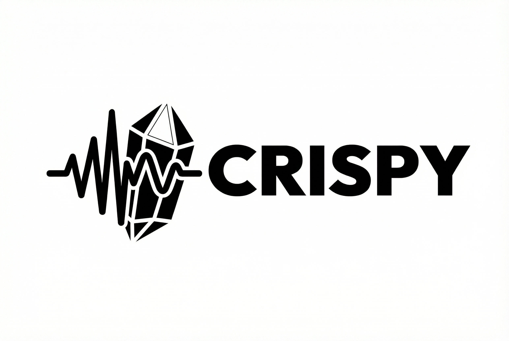

<div align="center">
  

  <h3>Real-time AI noise suppression, transcription, and meeting recording</h3>
  
  <p>
    <strong>Privacy-first · Lightning-fast · Completely offline</strong>
  </p>

  <p>
    <a href="#features">Features</a> •
    <a href="#quick-start">Quick Start</a> •
    <a href="#how-it-works">How It Works</a> •
    <a href="#development">Development</a>
  </p>
</div>

---

## What is Crispy?

**Crispy** is a powerful desktop application that enhances your audio in real-time with AI-powered noise suppression, automatic transcription, and intelligent meeting recording—all without sending your data to the cloud.

Built with **Tauri v2** (Rust backend + React/TypeScript frontend), Crispy processes everything locally on your machine, ensuring your conversations remain private while delivering professional-quality audio.

## ✨ Features

### 🎙️ Noise Suppression
- **RNN Noise** (nnnoiseless): real-time neural denoiser, 48 kHz, built-in model
- **None / Test noise**: passthrough or debug mode
- **Adaptive volume control** to maintain consistent levels
- **Zero-latency monitoring** for immediate feedback
- Routes clean audio to any application (Zoom, Discord, Teams, etc.)

### 📝 Smart Transcription
- **Automatic transcription** of all your recordings
- **Chat with AI** about your transcriptions using OpenAI/Poe.com
- **Model metadata** tracking—always know which model was used
- **Chat history** saved locally per recording

### 🎬 Meeting Recording
- **Dual-source capture**: Microphone + application audio (e.g., browser, Zoom)
- **Stereo output**: Mixed dual-mono for perfect playback
- **Auto-resampling**: Handles different sample rates (44.1kHz → 48kHz)
- **One-click recording** from system tray

### 🔒 Privacy-First Design
- **100% offline processing** - no internet required for noise suppression
- **Local storage** - recordings, transcriptions, and settings stay on your machine
- **Optional cloud AI** - only for chat features, with your explicit API keys

### 🎨 Beautiful UX
- **System tray popup** for quick controls
- **Dark mode ready** with a clean, modern interface
- **Settings persistence** across dev/release builds

## 🚀 Quick Start

### Prerequisites

- **macOS 13.0+** (Ventura or later) for ScreenCaptureKit support
- **Node.js 18+** and **npm**
- **Rust** (latest stable)
- **Xcode Command Line Tools**: `xcode-select --install`

### Installation

1. **Clone the repository:**
   ```bash
   git clone https://github.com/yourusername/crispy.git
   cd crispy
   ```

2. **Install dependencies:**
   ```bash
   make install
   ```

3. **Install BlackHole 2ch (recommended):**
   
   BlackHole is a virtual audio driver for routing processed audio to other apps.
   
   ```bash
   # Download from:
   https://existential.audio/blackhole/
   ```

4. **Run in development:**
   ```bash
   make dev
   ```

5. **Build for production:**
   ```bash
   make build
   ```
   The app bundle will be in `target/aarch64-apple-darwin/release/bundle/`
   
   > **Note**: If you get `invalid value '1' for '--ci'` error, unset the CI variable:
   > ```bash
   > unset CI && make build
   > ```

### First-Time Setup

1. **Grant microphone permissions** when prompted
2. **Grant screen recording permissions** (required for app audio capture)
3. **Select your microphone** in Settings → General
4. **Select BlackHole 2ch** as output device (or any virtual audio device)
5. **Choose a noise suppression model** in the footer (General screen): None, Test noise, or RNN Noise (48 kHz mic recommended)
6. **Optionally configure LLM** in Settings → LLM Chat (for transcription chat)

## 🏗️ How It Works

### Audio Pipeline

```
┌─────────────┐    ┌──────────────┐    ┌─────────────┐    ┌──────────────┐
│  Microphone │ -> │ Noise Model  │ -> │  Monitor    │ -> │  BlackHole   │ -> Apps
│  (Physical) │    │ RNNoise/None │    │  + Record   │    │  (Virtual)   │    (Zoom, etc.)
└─────────────┘    └──────────────┘    └─────────────┘    └──────────────┘
                                              │
                                              v
                                        ┌─────────────┐
                                        │   WAV File  │
                                        │  + App Audio│
                                        └─────────────┘
```

### Technology Stack

**Frontend**
- React 18 + TypeScript
- Tailwind CSS v4 (modern design system)
- Tauri API for native integration
- Real-time event streaming

**Backend (Rust)**
- **Audio**: CPAL (cross-platform audio), Hound (WAV I/O), Rubato (resampling)
- **Noise Suppression**: [nnnoiseless](https://github.com/jneem/nnnoiseless) (RNNoise port, in `./rnnnoise`), frame-based 48 kHz
- **Transcription**: transcribe-rs + ONNX Runtime (Whisper, Parakeet, Moonshine)
- **App Audio Capture**: ScreenCaptureKit (macOS 12.3+)
- **LLM Integration**: async-openai SDK for chat streaming
- **Persistence**: JSON-based settings + metadata

**macOS Integration**
- System tray with webview popup
- Window positioning via `tauri-plugin-positioner`
- Native permissions (Microphone, Screen Recording)

## 📦 Installation for Users

See detailed installation instructions: **[INSTALL.md](./INSTALL.md)**

**Quick start:**
1. Download `Crispy.app` and move to `/Applications/`
2. **Right-click** on the icon → **Open** (not double-click!)
3. Confirm opening in the dialog

This bypasses macOS Gatekeeper for unsigned apps. After the first launch, you can open normally.

---

## 📖 Usage Guide

### Basic Workflow

1. **Start monitoring**: Your mic is processed in real-time and routed to the output device
2. **Start recording**: Click record in settings or use the system tray
3. **Stop recording**: Audio is saved to `~/Documents/Crispy/Recordings/`
4. **View transcription**: Auto-generated for each recording (if model selected)
5. **Chat with AI**: Ask questions about your transcription using LLM

### Recording with App Audio

To record both your mic and application audio (e.g., Zoom calls):

1. Go to **Settings → Recording → App Audio Capture**
2. Select the application (Chrome, Zoom, etc.)
3. Start recording—both sources will be mixed in stereo

### Transcription

1. **Download a model**: Settings → Transcription → Download models
2. **Activate a model**: Select it from the dropdown
3. **Record**: Transcription happens automatically after recording stops
4. **View results**: Click any recording to see the transcription window

### LLM Chat (Optional)

Configure in **Settings → LLM Chat**:
- **Endpoint**: `https://api.openai.com/v1` (or `https://api.poe.com/v1`)
- **API Key**: Your OpenAI/Poe API key
- **Model**: `gpt-4`, `claude-3-5-sonnet`, etc.

Once configured, chat with AI about your transcriptions to summarize, translate, or extract insights.

## 🛠️ Development

### Project Structure

```
crispy/
├── src/                    # React/TypeScript frontend
│   ├── components/        # UI components
│   ├── hooks/             # React hooks (settings, models)
│   └── main.tsx           # Entry point
├── src-tauri/             # Rust backend
│   ├── src/
│   │   ├── main.rs        # Tauri app setup, audio pipeline, NS/TS models
│   │   ├── recording.rs   # Recording logic, ScreenCaptureKit
│   │   ├── commands/      # Tauri commands (models, ns_models, transcription, …)
│   │   └── managers/      # Transcription + model managers
│   ├── build.rs           # Build script (Swift linking)
│   └── Cargo.toml         # Rust dependencies
└── Makefile               # Build targets and commands
```

### Useful Commands

```bash
make help                 # Show all available commands
make dev                  # Run in development mode
make build                # Build release binary
make clean                # Clean build artifacts
make install              # Install dependencies
```

### Debugging

**Enable Rust logs:**
```bash
RUST_LOG=debug make dev
```

**Check audio devices:**
```rust
// In Rust backend
println!("Available devices: {:?}", devices);
```

## 🗺️ Roadmap

- [x] Real-time noise suppression
- [x] Device selection and audio routing
- [x] Live audio monitoring with meters
- [x] Recording (mic + app audio)
- [x] Auto-transcription with multiple models
- [x] LLM chat integration (streaming responses)
- [x] System tray with quick controls
- [x] Settings persistence
- [x] ScreenCaptureKit app audio capture
- [x] RNN Noise as first real noise suppression model
- [ ] Custom hotkeys
- [ ] Windows/Linux support
- [ ] Additional noise suppression models
- [ ] Audio effects (EQ, compressor)

## 🤝 Contributing

Contributions are welcome! Please feel free to submit issues or pull requests.

## 📄 License

MIT License - see [LICENSE](LICENSE) for details

---

<div align="center">
  <sub>Built with ❤️ using Rust, React, and Tauri</sub>
</div>
